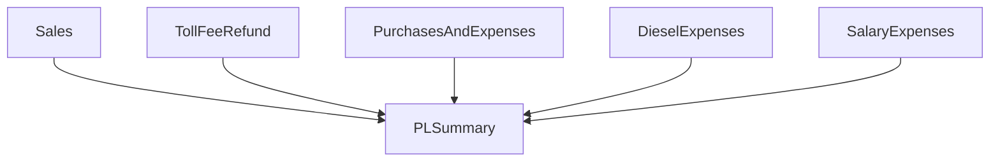
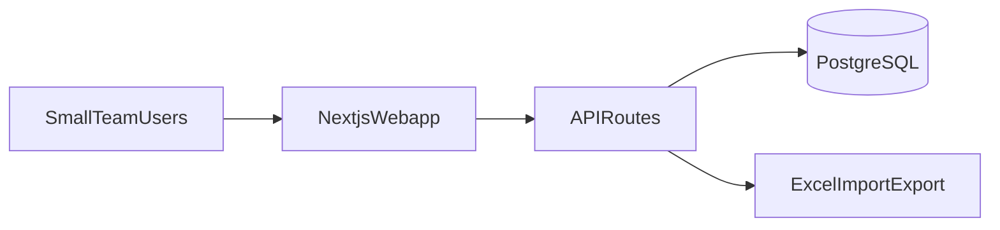

# DNL P&L Spreadsheet Review and Webapp Plan

## What the spreadsheet does today

**File reviewed:** `/Users/romelordinario/Downloads/Copy of 5. DNL MAY. 2026 P&L.xlsx`

This is a **monthly Profit & Loss workbook** for **DNL Transport Services** (trucking/logistics). The period marker in each sheet is **May 2026** (Excel serial `46153`). Data volume for May is modest:


| Sheet                  | Purpose                           | ~Rows this month     |
| ---------------------- | --------------------------------- | -------------------- |
| P&L SUMMARY            | Roll-up dashboard                 | 5 categories + total |
| SALES                  | Trip revenue by truck/customer    | 48                   |
| PURCHASES AND EXPENSES | Parts, repairs, household, garage | 21                   |
| DIESEL EXPENSES        | Fuel purchases                    | 25                   |
| SALARY EXPENSES        | Payroll and advances              | 31                   |
| TOLL FEE REFUND        | Toll reimbursements               | 13                   |


Each detail sheet feeds the summary via cell references. The **net P&L formula** is:

```text
TOTAL = SALES + TOLL_FEE_REFUND - PURCHASES - SALARY - DIESEL
```

Expense categories also show **% of sales** (e.g. `Purchases / Sales`).




---

## Sheet-by-sheet breakdown

### 1. P&L SUMMARY (dashboard)

- Lists 5 income/expense categories with amounts pulled from other sheets.
- Computes **expense ratios** as a % of total sales.
- **Only 9 formulas** — entirely dependent on other tabs; no manual entry here.

**Webapp implication:** This should be a **read-only computed view**, not a data-entry screen.

### 2. SALES

Columns: `Date | Plate No. | Customer | Delivery Site | No. of Trips | Amount (x5 weekly cols) | Weekly TTL`

- Amount is entered in **one of 5 columns (F–J)**, apparently representing **weeks within the month** (48 entries use F most often; G–J used selectively).
- P&L only sums **column F** (`SUM(F7:F125)` → `SALES!F127`). Columns G–J and `WEEKLY TTL` (K) are **not wired into the P&L total** in this file.
- Customers include CLIMATECH, HTN STEEL, SAN MIGUEL CORPORATION, etc.
- Trucks: `PGJ736`, `NCS129`, `UFJ992`, `UNM562`.

**Webapp implication:** Store a single `amount` per sale (week 1 / column F only). Columns G–J and `WEEKLY TTL` are legacy layout for Excel export; do not track multi-week sales in reports or P&L.

### 3. PURCHASES AND EXPENSES

Columns: `Date | PO No | Plate No | Supplier | Description | Qty | Unit | U. Price | Amount | Total`

- Mix of **truck expenses** (parts, vulcanize, brake fluid) and **non-truck buckets** (`HOUSEHOLD`, `GARAGE`, `PALENGKE`).
- `PO No` is either `CASH` / `cash` or a numeric PO (e.g. `2837`).
- One formula derives unit price: `U. Price = Amount / Qty` (row 10); most rows enter price directly.
- Monthly total: `SUM(I6:I150)`.

**Webapp implication:** Normalize `PO No` (cash vs numbered PO). Auto-calculate `amount = qty * unitPrice` when both are present, but allow direct amount entry (matches current practice).

### 4. DIESEL EXPENSES

Columns: `Date | P.O Number | Plate Number | Supplier | Description | Qty | Unit | Unit Price | Amount`

- Suppliers: GLOBAL OIL, FLYING V, CRYSTAL OIL, UNO FUEL, etc.
- Tracks liters and price per liter; some rows omit supplier/qty.
- Monthly total: `SUM(I6:I48)`.

**Webapp implication:** Structurally similar to purchases but separate module (as in the spreadsheet). Could share a common "expense line item" pattern in code.

### 5. SALARY EXPENSES

Columns: `Date | Plate No | Remarks | Employee | Amount` plus header columns `JUN | JHOANNA | JERRRICA | JOAN | ARIEL`

- `Remarks` is mostly `SALARY`; `Plate No` can be `HOUSEHOLD`, `DNL`, or a truck plate.
- The F–J admin columns are **barely used** (2 cells each); real data lives in the `Employee` + `Amount` columns.
- Two sum ranges exist (`E63`, `E126`) suggesting a **template for multiple pay periods** within the month; P&L uses `E63`.

**Webapp implication:** Treat F–J as legacy/unused. Primary fields: date, separate cost center field, plate (when applicable), employee, amount, remarks.

### 6. TOLL FEE REFUND

Columns: `Date | Plate No | Delivery Site | Amount`

- Simplest module; 13 entries in May.
- Monthly total: `SUM(D8:D60)`.

---

## Pain points in the manual spreadsheet

These are the strongest reasons to move to a webapp:

1. **Cross-sheet formula fragility** — P&L breaks if someone inserts rows or edits the wrong total cell on a detail sheet.
2. **Inconsistent manual entry** — `CASH` vs `cash`, `PGJ736` vs `pGJ736`, mixed plate/cost-center values.
3. **Oversized template** — ~1,000 rows per sheet; easy to lose track of where real data ends.
4. **Ambiguous weekly sales columns** — 5 "AMOUNT" headers with no week labels; only week 1 (col F) feeds P&L.
5. **No audit trail** — no record of who entered or changed a row.
6. **No multi-month archive** — each month is presumably a new file copy (filename suggests "Copy of 5. DNL MAY. 2026").
7. **Partial/incomplete rows** — some diesel and purchase rows missing supplier, qty, or unit price.

The webapp should **enforce validation** and **compute totals server-side**, eliminating formula maintenance.

---

## Recommended webapp architecture

**Workspace:** `[/Users/romelordinario/Documents/2026/dnl-ts](/Users/romelordinario/Documents/2026/dnl-ts)` is empty — greenfield build.

**Stack (TypeScript-aligned with project name):**


| Layer     | Recommendation                                                                      |
| --------- | ----------------------------------------------------------------------------------- |
| Framework | **Next.js** (App Router) — UI + API in one repo                                     |
| Database  | **PostgreSQL** (Supabase or Neon) — multi-month history, relational data            |
| ORM       | **Prisma** or **Drizzle**                                                           |
| Auth      | **Simple email/password** or magic link for 2–5 users (NextAuth / Auth.js or Clerk) |
| Excel I/O | **ExcelJS** — import existing `.xlsx`, export monthly reports                       |
| UI        | **shadcn/ui** + tables with inline add/edit (familiar spreadsheet feel)             |
| Deploy    | Vercel + managed Postgres                                                           |





---

## Data model (core entities)

```text
User
  id, email, name, role (admin | viewer)

Period (month)
  id, year, month, status (open | closed), createdAt

Plate
  id, code (PGJ736, NCS129, UFJ992, UNM562, ...)

CostCenter
  id, code (HOUSEHOLD, DNL, GARAGE, PALENGKE, ...)

-- Transaction tables (all scoped to periodId) --

Sale
  date, plateId, customer, deliverySite, trips, amount

PurchaseExpense
  date, poNumber, plateId?, costCenterId?, supplier, description, qty, unit, unitPrice, amount

DieselExpense
  date, poNumber, plateId, supplier, description, qty, unit, unitPrice, amount

SalaryExpense
  date, plateId?, costCenterId?, employee, remarks, amount

TollFeeRefund
  date, plateId, deliverySite, amount
```

**Computed (never stored as source of truth, only cached for display):**

- Category totals per period
- P&L net: `sales + toll - purchases - salary - diesel`
- Expense ratios: `categoryTotal / salesTotal`

**Master data** (customers, suppliers, employees) can start as free-text (matching spreadsheet) and later become dropdowns as values stabilize.

---

## App screens / modules

1. **Login** — simple team access
2. **Period selector** — switch between May 2026, June 2026, etc.; create new month
3. **P&L Dashboard** — mirrors `P&L SUMMARY`; primary landing page
4. **Sales** — CRUD table
5. **Purchases & Expenses** — CRUD table
6. **Diesel** — CRUD table
7. **Salary** — CRUD table
8. **Toll Fee Refund** — CRUD table
9. **Import / Export**
  - Import: upload `.xlsx`, map sheets → DB for a selected period
  - Export: generate workbook matching current sheet layout (for continuity with existing workflows)
10. **Settings** (admin) — manage plates, users, close/reopen periods

---

## Excel import/export strategy

**Import (priority for migration):**

- Parse the 6 sheet names exactly as they exist today.
- Detect period from the `A3` date serial on any detail sheet.
- Map rows by header row (row 5 for most sheets).
- Normalize on ingest: uppercase plates, unify `CASH`/`cash`, trim whitespace.
- Flag rows that fail validation (missing amount, unparseable date) for user review before commit.

**Export:**

- Generate `.xlsx` with the same 6 tabs and column headers so the team can still share files with accountants or fall back to Excel if needed.
- Pre-fill summary sheet formulas as **computed values** (not live Excel formulas) to avoid broken references.

---

## Phased implementation

### Phase 1 — Foundation (MVP)

- Auth for small team
- Period management (create/list/select month)
- CRUD for all 5 transaction modules
- Live P&L dashboard with correct formula
- Basic validation (required date + amount, normalized plates)

### Phase 2 — Excel parity

- Import May 2026 workbook (and future months) into DB
- Export monthly `.xlsx` matching current layout

### Phase 3 — Quality of life

- Master data dropdowns (customers, suppliers, employees, plates)
- Period close/lock (prevent edits on finalized months)
- Audit log (who changed what)
- Per-truck and per-category reports

---

## Key decisions already captured

- **Users:** Small team (2–5), simple login
- **History:** Multi-month + Excel import/export

## Confirmed before build

- **Weekly sales:** Week 1 only (column F) — G–J not tracked in reports
- **Cost centers:** Separate field — not mixed into plate codes
- **UI language:** English
- **Hosting:** Supabase free + Vercel/Netlify free — no separate API server

---

## Estimated complexity

This is a **medium-scope internal business app** — not a simple CRUD form. The spreadsheet logic is straightforward, but faithfully replicating 6 interconnected modules, multi-month history, Excel round-tripping, and team auth puts it at roughly **3–5 weeks** for a solid Phase 1–2 build by one developer.

The empty `[dnl-ts](/Users/romelordinario/Documents/2026/dnl-ts)` workspace is a good starting point for a Next.js + PostgreSQL monorepo.