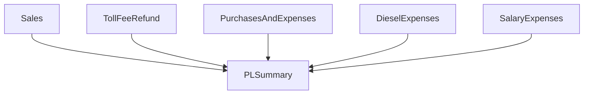
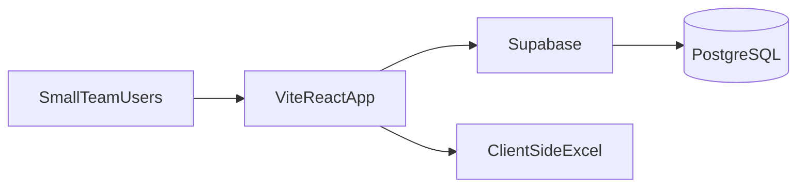

# DNL P&L Webapp — Project Plan

> Canonical reference for building DNL Transport Services' monthly P&L spreadsheet as a webapp.  
> **Stack:** React + TypeScript (TSX) + Vite · **Backend:** Supabase (free tier) · **Cost:** $0/month

---

## Overview

Convert the manual DNL Transport Services monthly P&L Excel workbook into a TypeScript webapp with:

- Small-team auth (2–5 users)
- Multi-month history (May 2026, June 2026, etc.)
- Excel import/export — preserving the existing 6-sheet workflow and P&L formula logic

**Source spreadsheet reviewed:** `/Users/romelordinario/Downloads/Copy of 5. DNL MAY. 2026 P&L.xlsx`

**Workspace:** `/Users/romelordinario/Documents/2026/dnl-ts`

---

## What the spreadsheet does today

This is a **monthly Profit & Loss workbook** for **DNL Transport Services** (trucking/logistics). The period marker in each sheet is **May 2026** (Excel serial `46153`). Data volume for May is modest:


| Sheet                  | Purpose                           | ~Rows this month     |
| ---------------------- | --------------------------------- | -------------------- |
| P&L SUMMARY            | Roll-up dashboard                 | 5 categories + total |
| SALES                  | Trip revenue by truck/customer    | 48                   |
| PURCHASES AND EXPENSES | Parts, repairs, household, garage | 21                   |
| DIESEL EXPENSES        | Fuel purchases                    | 25                   |
| SALARY EXPENSES        | Payroll and advances              | 31                   |
| TOLL FEE REFUND        | Toll reimbursements               | 13                   |


Each detail sheet feeds the summary via cell references. The **net P&L formula** is:

```text
TOTAL = SALES + TOLL_FEE_REFUND - PURCHASES - SALARY - DIESEL
```

Expense categories also show **% of sales** (e.g. `Purchases / Sales`).




---

## Sheet-by-sheet breakdown

### 1. P&L SUMMARY (dashboard)

- Lists 5 income/expense categories with amounts pulled from other sheets.
- Computes **expense ratios** as a % of total sales.
- **Only 9 formulas** — entirely dependent on other tabs; no manual entry here.

**Webapp implication:** Read-only computed view, not a data-entry screen.

### 2. SALES

Columns: `Date | Plate No. | Customer | Delivery Site | No. of Trips | Amount (x5 weekly cols) | Weekly TTL`

- Amount is entered in **one of 5 columns (F–J)**, representing **weeks within the month** (48 entries use F most often; G–J used selectively).
- P&L only sums **column F** (`SUM(F7:F125)` → `SALES!F127`). Columns G–J and `WEEKLY TTL` (K) are **not wired into the P&L total** in this file.
- Customers include CLIMATECH, HTN STEEL, SAN MIGUEL CORPORATION, etc.
- Trucks: `PGJ736`, `NCS129`, `UFJ992`, `UNM562`.

**Webapp implication:** Store a single `amount` per sale (week 1 / column F only). Columns G–J and `WEEKLY TTL` are legacy layout for Excel export; do not track multi-week sales in reports or P&L.

### 3. PURCHASES AND EXPENSES

Columns: `Date | PO No | Plate No | Supplier | Description | Qty | Unit | U. Price | Amount | Total`

- Mix of **truck expenses** (parts, vulcanize, brake fluid) and **non-truck buckets** (`HOUSEHOLD`, `GARAGE`, `PALENGKE`).
- `PO No` is either `CASH` / `cash` or a numeric PO (e.g. `2837`).
- One formula derives unit price: `U. Price = Amount / Qty` (row 10); most rows enter price directly.
- Monthly total: `SUM(I6:I150)`.

**Webapp implication:** Normalize `PO No` (cash vs numbered PO). Auto-calculate `amount = qty * unitPrice` when both are present, but allow direct amount entry.

### 4. DIESEL EXPENSES

Columns: `Date | P.O Number | Plate Number | Supplier | Description | Qty | Unit | Unit Price | Amount`

- Suppliers: GLOBAL OIL, FLYING V, CRYSTAL OIL, UNO FUEL, etc.
- Tracks liters and price per liter; some rows omit supplier/qty.
- Monthly total: `SUM(I6:I48)`.

**Webapp implication:** Structurally similar to purchases but separate module (as in the spreadsheet). Could share a common "expense line item" pattern in code.

### 5. SALARY EXPENSES

Columns: `Date | Plate No | Remarks | Employee | Amount` plus header columns `JUN | JHOANNA | JERRRICA | JOAN | ARIEL`

- `Remarks` is mostly `SALARY`; `Plate No` can be `HOUSEHOLD`, `DNL`, or a truck plate.
- The F–J admin columns are **barely used** (2 cells each); real data lives in the `Employee` + `Amount` columns.
- Two sum ranges exist (`E63`, `E126`) suggesting a template for multiple pay periods within the month; P&L uses `E63`.

**Webapp implication:** Treat F–J as legacy/unused. Primary fields: date, separate cost center field, plate (when applicable), employee, amount, remarks.

### 6. TOLL FEE REFUND

Columns: `Date | Plate No | Delivery Site | Amount`

- Simplest module; 13 entries in May.
- Monthly total: `SUM(D8:D60)`.

---

## Pain points in the manual spreadsheet

1. **Cross-sheet formula fragility** — P&L breaks if someone inserts rows or edits the wrong total cell.
2. **Inconsistent manual entry** — `CASH` vs `cash`, `PGJ736` vs `pGJ736`, mixed plate/cost-center values.
3. **Oversized template** — ~1,000 rows per sheet; easy to lose track of where real data ends.
4. **Ambiguous weekly sales columns** — 5 "AMOUNT" headers with no week labels; only week 1 (col F) feeds P&L.
5. **No audit trail** — no record of who entered or changed a row.
6. **No multi-month archive** — each month is a new file copy.
7. **Partial/incomplete rows** — some diesel and purchase rows missing supplier, qty, or unit price.

The webapp should **enforce validation** and **compute totals in app code** (not Excel formulas), eliminating formula maintenance.

---

## Architecture — $0 default (decided)

No custom Node API. No paid hosting required for a 2–5 user internal app.




### Stack


| Layer               | Choice                                             | Notes                                                          |
| ------------------- | -------------------------------------------------- | -------------------------------------------------------------- |
| **Frontend**        | **Vite + React + TypeScript (TSX)**                | User's preferred stack                                         |
| **Routing**         | **React Router**                                   | Client-side routes for modules                                 |
| **UI**              | **shadcn/ui + Tailwind CSS**                       | Spreadsheet-style tables, familiar feel                        |
| **Data fetching**   | **TanStack Query**                                 | Cache Supabase responses, optimistic updates                   |
| **Forms**           | **React Hook Form + Zod**                          | Validation on entry and import                                 |
| **Backend**         | **Supabase**                                       | Auth + PostgreSQL + auto-generated REST API                    |
| **Database client** | **@supabase/supabase-js**                          | No Prisma, no custom ORM                                       |
| **Auth**            | **Supabase Auth**                                  | Email/password for 2–5 users                                   |
| **Excel I/O**       | **ExcelJS or SheetJS** (browser)                   | Parse/generate `.xlsx` client-side — no second server          |
| **P&L logic**       | **Client-side + optional Supabase RPC**            | Sum transactions in TS; optional Postgres view for consistency |
| **Deploy**          | **Vercel or Netlify** (free) + **Supabase** (free) | $0/month at this scale                                         |


### Why this architecture

- **Free** — Supabase free tier + static frontend hosting covers 2–5 users with no credit card required to start.
- **No server to maintain** — no Express/Hono deploy, no Railway/Render bill.
- **SQL fits P&L** — Postgres handles relational monthly data better than Firebase Firestore.
- **Excel in browser** — May 2026–style workbooks are small enough; acceptable for a trusted small team.

### Free tier caveats (Supabase)

- Project **pauses after ~1 week of inactivity** (wakes on next visit).
- **500 MB** database — plenty for years of P&L rows.
- **2 free projects** per Supabase account.

### Upgrade path (only if needed later)


| Trigger                                | Add                                              |
| -------------------------------------- | ------------------------------------------------ |
| Large Excel files feel slow in browser | Small Node API on Render free tier (cold starts) |
| Stricter server-side validation        | Supabase Edge Functions or thin Node service     |
| Always-on API, no cold starts          | ~$5–7/month hosted worker                        |


### Alternatives considered (not chosen)


| Option                       | Why not (for this app)                           |
| ---------------------------- | ------------------------------------------------ |
| **Next.js**                  | User prefers Vite + React                        |
| **Node API + Prisma**        | More to build/maintain than needed for 2–5 users |
| **Firebase (Firestore)**     | Awkward for relational P&L + Excel               |
| **Supabase + paid Node API** | Unnecessary cost at current scale                |


### Suggested repo layout

```text
dnl-ts/
├── PLAN.md
├── supabase/
│   └── schema.sql          # Tables, RLS policies, optional RPC for P&L
├── .env.example            # VITE_SUPABASE_URL, VITE_SUPABASE_ANON_KEY
├── package.json
├── vite.config.ts
└── src/
    ├── pages/              # Dashboard, Sales, Purchases, etc.
    ├── components/         # Tables, forms, layout
    ├── lib/
    │   ├── supabase.ts     # Supabase client
    │   ├── pl.ts           # P&L computation
    │   └── excel/          # Import + export (client-side)
    ├── hooks/
    └── types/
```

### Why not Next.js

The user is familiar with **React + TSX + Vite**. Supabase replaces the need for a custom API layer; the React app talks directly to Postgres via the Supabase client.

---

## Data model (core entities)

```text
User
  id, email, name, role (admin | viewer)

Period (month)
  id, year, month, status (open | closed), createdAt

Plate
  id, code (PGJ736, NCS129, UFJ992, UNM562, ...)

CostCenter
  id, code (HOUSEHOLD, DNL, GARAGE, PALENGKE, ...)

-- Transaction tables (all scoped to periodId) --

Sale
  date, plateId, customer, deliverySite, trips, amount

PurchaseExpense
  date, poNumber, plateId?, costCenterId?, supplier, description, qty, unit, unitPrice, amount

DieselExpense
  date, poNumber, plateId, supplier, description, qty, unit, unitPrice, amount

SalaryExpense
  date, plateId?, costCenterId?, employee, remarks, amount

TollFeeRefund
  date, plateId, deliverySite, amount
```

**Computed (never stored as source of truth):**

- Category totals per period
- P&L net: `sales + toll - purchases - salary - diesel`
- Expense ratios: `categoryTotal / salesTotal`

**Master data** (customers, suppliers, employees) can start as free-text and later become dropdowns.

---

## App screens / modules

1. **Login** — simple team access
2. **Period selector** — switch between months; create new period
3. **P&L Dashboard** — mirrors `P&L SUMMARY`; primary landing page
4. **Sales** — CRUD table
5. **Purchases & Expenses** — CRUD table
6. **Diesel** — CRUD table
7. **Salary** — CRUD table
8. **Toll Fee Refund** — CRUD table
9. **Import / Export**
  - Import: upload `.xlsx`, map sheets → DB for a selected period
  - Export: generate workbook matching current sheet layout
10. **Settings** (admin) — manage plates, users, close/reopen periods

---

## Excel import/export strategy

### Import (priority for migration)

- Parse the 6 sheet names exactly as they exist today.
- Detect period from the `A3` date serial on any detail sheet.
- Map rows by header row (row 5 for most sheets).
- Normalize on ingest: uppercase plates, unify `CASH`/`cash`, trim whitespace.
- Flag rows that fail validation for user review before commit.

### Export

- Generate `.xlsx` with the same 6 tabs and column headers.
- Pre-fill summary sheet as **computed values** (not live Excel formulas).

---

## Phased implementation

### Phase 1 — Foundation (MVP)

- [x] Scaffold Vite React app + Supabase project (free tier)
- [x] PostgreSQL schema in `supabase/schema.sql` + RLS policies
- [x] Supabase Auth for small team
- [x] Period management (create/list/select month)
- [x] CRUD for all 5 transaction modules
- [x] Live P&L dashboard with correct formula
- [x] Basic validation (required date + amount, normalized plates)

### Phase 2 — Excel parity

- [x] Client-side import of May 2026 workbook (and future months) into Supabase
- [x] Client-side export of monthly `.xlsx` matching current layout

### Phase 3 — Quality of life

- [x] Master data dropdowns (customers, suppliers, employees, plates)
- [x] Period close/lock (prevent edits on finalized months)
- [x] Audit log (who changed what)
- [x] Per-truck and per-category reports

---

## Implementation todos


| ID              | Task                                                                             | Status  |
| --------------- | -------------------------------------------------------------------------------- | ------- |
| `scaffold-vite` | Scaffold Vite React (TSX) + Supabase client in `dnl-ts`                          | done |
| `data-model`    | Define Supabase SQL schema: Period, 5 transaction tables, Plate + CostCenter + RLS | done |
| `crud-modules`  | Build CRUD UI for Sales, Purchases, Diesel, Salary, Toll modules                 | done |
| `pl-dashboard`  | Implement computed P&L summary with expense ratios (`src/lib/pl.ts`)             | done |
| `excel-import`  | Client-side importer for existing 6-sheet workbook format                        | done |
| `excel-export`  | Client-side exporter matching current sheet layout                               | done |
| `validation`    | Add normalization (plates, CASH) and required-field validation on entry          | done |


---

## Key decisions captured


| Decision         | Choice                                                              |
| ---------------- | ------------------------------------------------------------------- |
| **Users**        | Small team (2–5), simple login                                      |
| **History**      | Multi-month + Excel import/export                                   |
| **Frontend**     | React + TypeScript (TSX) + Vite                                     |
| **Backend**      | **Supabase** (Auth + PostgreSQL) — no custom Node API               |
| **Excel**        | **Client-side** (browser) — no paid API host                        |
| **Cost**         | **$0/month** — Supabase free + Vercel/Netlify free                  |
| **ORM**          | **None** — `@supabase/supabase-js` directly                         |
| **Weekly sales** | **Week 1 only** — column F feeds P&L; G–J not tracked in reports  |
| **Cost centers** | **Separate field** — `HOUSEHOLD`, `DNL`, `GARAGE` not mixed into plates |
| **UI language**  | **English**                                                         |
| **Hosting**      | Supabase free + Vercel/Netlify free — no separate API server        |

---

## Estimated complexity

Medium-scope internal business app. Spreadsheet logic is straightforward, but faithfully replicating 6 interconnected modules, multi-month history, Excel round-tripping, and team auth is roughly **3–5 weeks** for a solid Phase 1–2 build by one developer.

---

## Reference: P&L computation

```typescript
// Implement in src/lib/pl.ts — runs in the React app from Supabase-fetched rows
function computePL(totals: {
  sales: number;
  toll: number;
  purchases: number;
  salary: number;
  diesel: number;
}) {
  const { sales, toll, purchases, salary, diesel } = totals;
  const net = sales + toll - purchases - salary - diesel;

  return {
    sales,
    tollFeeRefund: toll,
    purchases,
    salary,
    diesel,
    net,
    ratios: {
      purchases: sales > 0 ? purchases / sales : 0,
      salary: sales > 0 ? salary / sales : 0,
      diesel: sales > 0 ? diesel / sales : 0,
    },
  };
}
```

Optional later: mirror the same logic in a **Supabase RPC** or Postgres view if totals must be computed server-side for reporting consistency.

---

## Supabase setup checklist

1. Create a free project at [supabase.com](https://supabase.com)
2. Run `supabase/schema.sql` in the SQL Editor
3. Enable Email auth under Authentication → Providers
4. Copy project URL + anon key into `.env`:
  ```env
   VITE_SUPABASE_URL=https://xxxx.supabase.co
   VITE_SUPABASE_ANON_KEY=eyJ...
  ```
5. Deploy frontend to Vercel or Netlify (connect repo, add env vars)

## Others:
supabase password: Xv5pdbJfxakWGrtn

